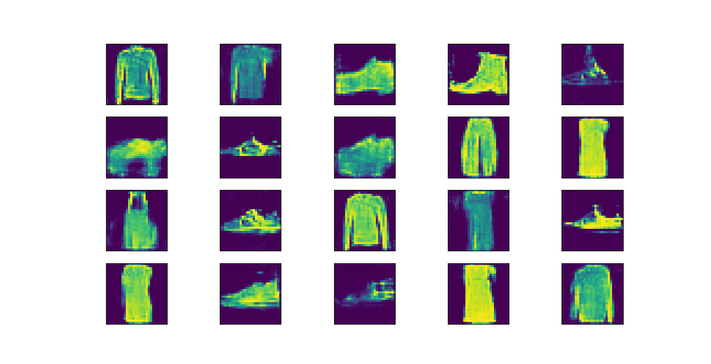
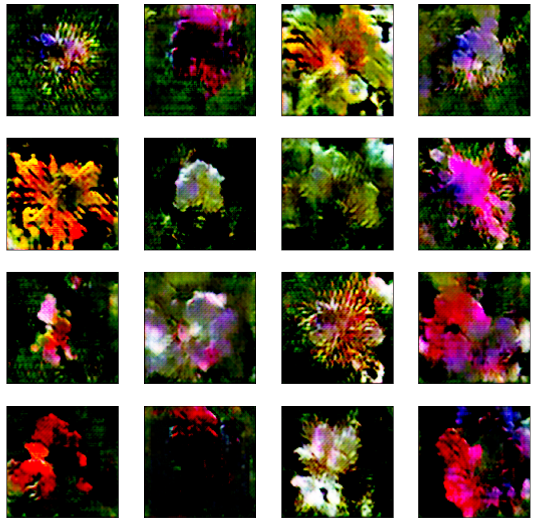

# pytorch_gan

Simple trainer for GAN models on famous datasets or on customize datasets.

## How to use?

```
python train.py \
  --model {digits_gan,mnist_gan,cifar10_gan,simple_general_dcnn_gan,model_template_1} \
  --dataset {digits,mnist,kmnist,fashion_mnist,cifar10,cifar100,image_folder,dataloader_template_1} \
  --root ROOT_PATH \
  --batch-size BATCH_SIZE \
  --gpu \
  --lr LR  \
  --epochs EPOCHS \
  --optim OPTIM  \
  --save-model  \
  --customize \
  --start-model START_MODEL \
  --freq-samples FREQ_SAMPLES
```

```
python test.py \
  --model {digits_gan,mnist_gan,cifar10_gan,simple_general_dcnn_gan,model_template_1} \
  --gpu \
  --lr LR  \
  --model-path  MODEL_PATH \
  --customize  \
  --num-imgs NUM_IMAGES
```

You can create customize models and dataloader by creating a file called customize.py with the following functions (the name of the functions should be exactly as shown below)

```python
def create_model_customize(args):
    # generator = nn.Sequential(
    #    ...
    # )

    # discriminator = nn.Sequential(
    #     ...
    # )

    # return generator, discriminator
    pass


def create_dataloader_customize(args):
    # return train_dl, test_dl
    pass
```

## Samples of Images generated

Some images generated on models that were traing with this tool.

### Fashion



### Flowers


