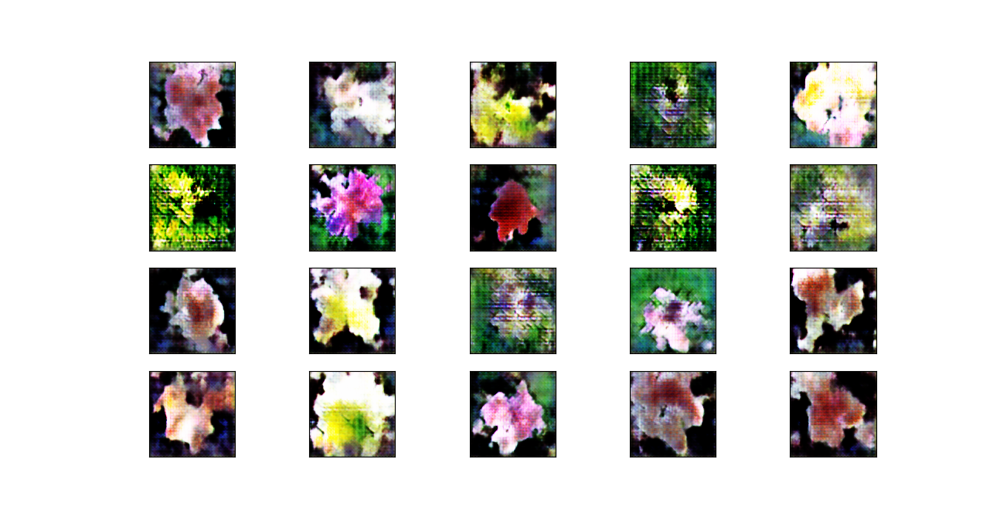

# pytorch_gan
Simple trainer for GAN models on famous datasets or on customize datasets.

## How to use?
```
python train.py \
  --model {digits_gan,mnist_gan,cifar10_gan,simple_general_dcnn_gan} \
  --dataset {digits,mnist,fashion_mnist,cifar10,cifar100,image_folder} \
  --batch-size BATCH_SIZE \
  --lr LR  \
  --epochs EPOCHS \
  --optim OPTIM  \
  --save-model  \
  --customize  
```

## Samples of Images generated
Some images generated on models that were traing with this tool.
### Fashion

### Flowers
